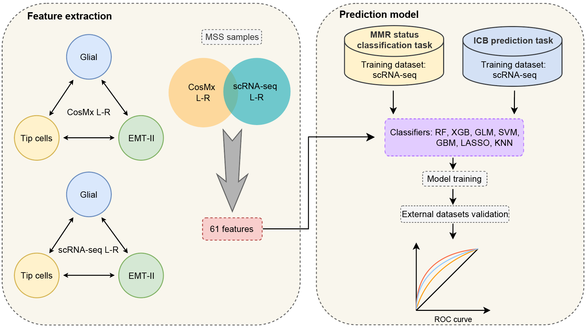

# A spatially defined glial-tip cell niche around tumor boundary promotes mesenchymal tumor states in microsatellite-stable colorectal cancer


## Introduction

We developed a cross-platform classifier TiGELR, a machine learning model via Tip cells-Glial cells-EMT II-related tumor cells Ligand-Receptor, accurately distinguishes MSS from MSI and stratifies immunotherapy outcomes.

## Citation
(Unpublished now)
```
@article{TiGELR,
    title={A spatially defined glial-tip cell niche around tumor boundary promotes mesenchymal tumor states in microsatellite-stable colorectal cancer},
    author={Dong Zhang#, Huifang Chen, Liang Gu, Xinyu Ding, Yi Yang, Xinyi Tan, Bing Su*, Jing Sun*, Youqiong Ye*},
    journal={XX},
    year={2026},
    doi={xx}
}

```
