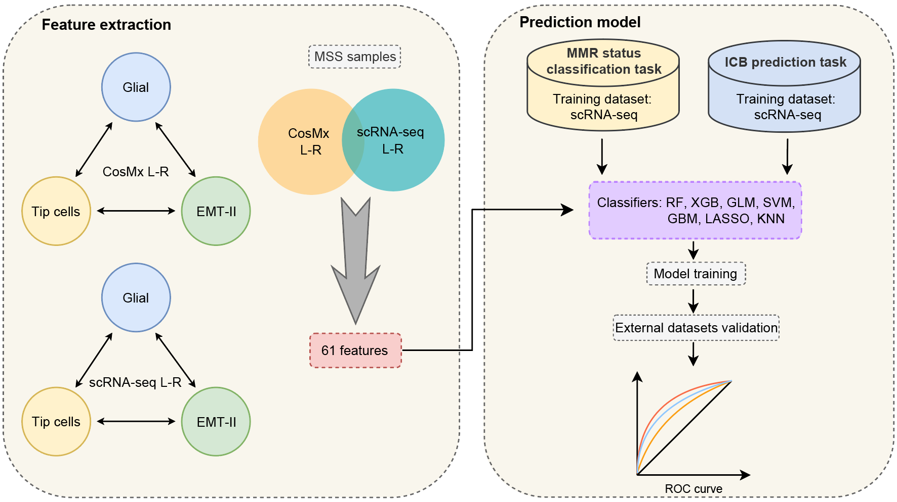

# Mesenchymal Tumors Feature a Spatially Defined Glial-Tip Cell Niche Around the Tumor Boundary in Microsatellite-Stable Colorectal Cancer


## Introduction

We developed a cross-platform classifier TiGELR, a machine learning model via Tip cells-Glial cells-EMT II-related tumor cells Ligand-Receptor, accurately distinguishes MSS from MSI and stratifies immunotherapy outcomes.

## Citation
```
@article{TiGELR,
    title={Mesenchymal Tumors Feature a Spatially Defined Glial-Tip Cell Niche Around the Tumor Boundary in Microsatellite-Stable Colorectal Cancer},
    author={Dong Zhang#, Huifang Chen#, Liang Gu#, Xinyu Ding, Yi Yang, Xinyi Tan, Bing Su*, Jing Sun*, Youqiong Ye*},
    journal={Cancer Research},
    year={2026},
    doi={10.1158/0008-5472.CAN-25-5619}
}

```
